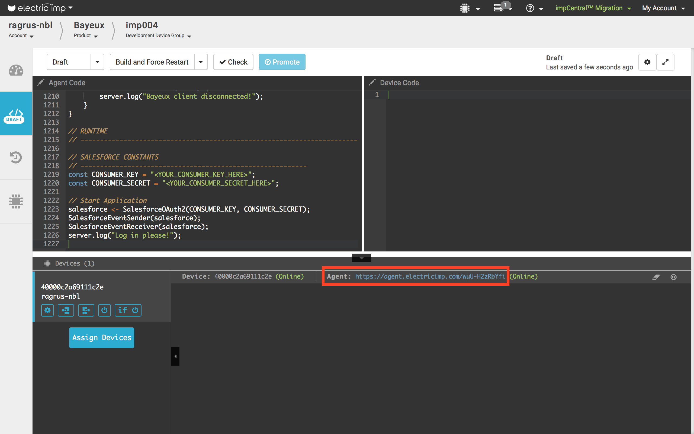
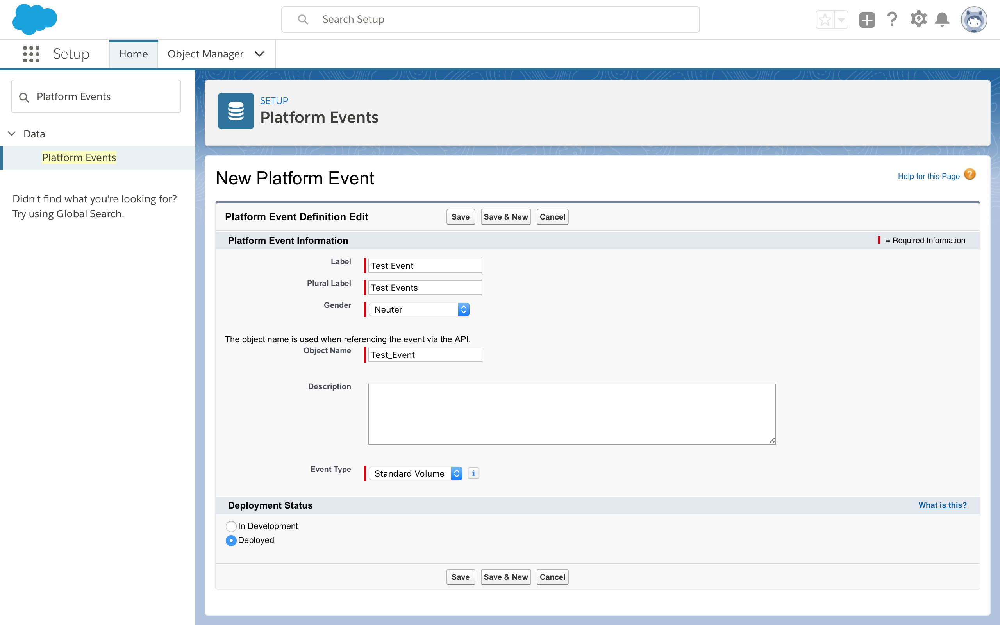
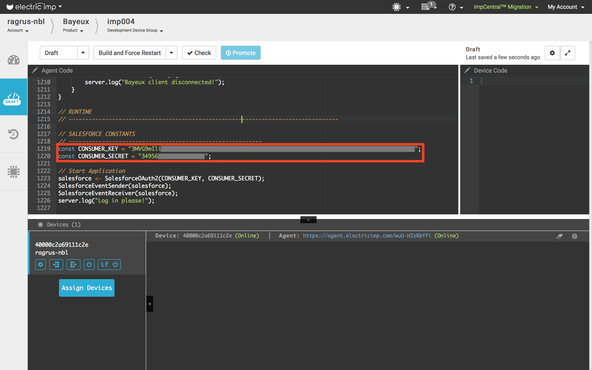
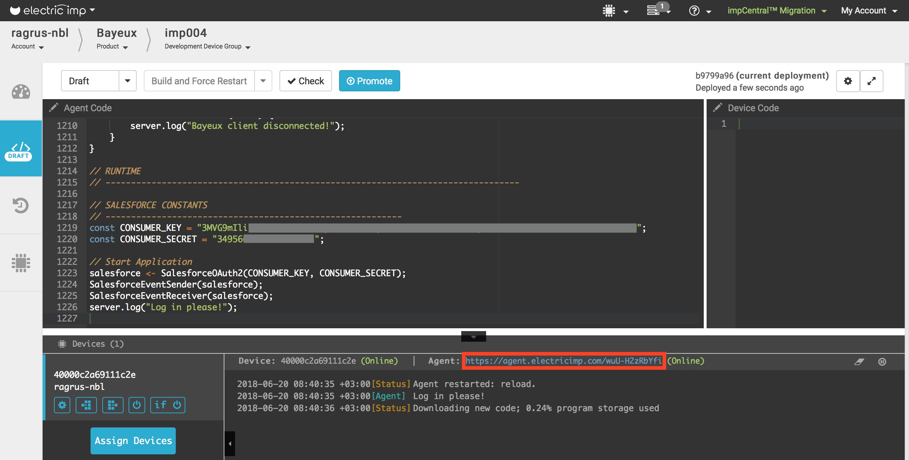
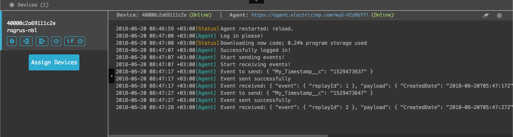

# Bayeux Client Examples #

This document describes the example applications provided with the [BayeuxClient library](../README.md).

## Salesforce Example ##

This example

- Authenticates the device on Salesforce platform using the provided Consumer Key and Consumer Secret.
- Subscribes to the events channel created on Salesforce during the setup.
- Periodically (every ten seconds) sends an event to the cloud. The event contains the current timestamp.
- Logs all events received from the cloud (exactly the events sent in the previous point).

This example uses the [Salesforce library](https://github.com/electricimp/Salesforce) for sending the events and the [BayeuxClient library](../README.md) for receiving them.

### Source Code ###

[Salesforce.agent.nut](./Salesforce.agent.nut)

### Example Setup ###

#### Set Up An imp-enabled Device ####

1. Add a development device to [your account](https://developer.electricimp.com/gettingstarted)
1. In [Electric Imp's impCentral™](https://impcentral.electricimp.com) create new a Product and a Development Device Group.
1. Assign the device to the newly created Device Group.
1. Copy the [Salesforce example source code](./Salesforce.agent.nut) and paste it into Devie Group’s code editor as the agent code.
1. Make a note of the agent’s URL. It will be required later on in the setup process:

1. Leave impCentral open in your browser &mdash; you will be returning to it later.

#### Login To Salesforce ####

If you are not registered as a developer, [create a developer account](https://developer.salesforce.com/signup).

Now login to [Salesforce Developer Edition org](https://login.salesforce.com/). 

#### Create A Salesforce Connected Application ####

This stage is used to authenticate the imp application in Salesforce.

11. Click the **Setup** icon in the top-right navigation menu and select **Setup**:

- Enter `App Manager` in the **Quick Find** box and then select **AppManager**:

1. Click **New Connected App**.
1. In the **New Connected App** form, enter:
    1. In the **Basic Information** section:
        1. Connected App Name: `Electric Imp Example`.
        1. API Name: this will automatically become `Electric_Imp_Example`.
        1. Contact Email: enter your email address.
    1. In the **API (Enable OAuth Settings)** section:
        1. Check **Enable OAuth Settings**.
        1. Callback URL: enter the agent URL of your device (copied from impCentral in an earlier step).
    1. Under **Selected OAuth Scopes**:
        1. Select **Access and manage your data (api)**.
        1. Click **Add**:

    1. Click **Save**.
    1. Click **Continue**.
1. You will be redirected to your Connected App’s page.
    1. Make a note of your **Consumer Key** (you will need to enter it into your agent code).
    1. Click **Click to reveal** next to the **Consumer Secret** field.
    1. Make a note of your **Consumer Secret** (you will need to enter it into your agent code):

1. **Do not close the Salesforce page**.

**Note** Any Salesforce Connected Application works only for the agent whose URL you entered in the OAuth Settings section.

#### Create A Platform Event In Salesforce ####

Platform Events transfer the data from the device to Salesforce.

The Platform Event fields must have the names and types mentioned here. If you change anything in the Platform Event definition, you will need to update the imp’s agent code. The names of the Platform Event and its field are entered into the agent code as constants *EVENT_NAME* and *EVENT_FIELD_NAME*.

1. On the Salesforce page, click the **Setup** icon in the top-right navigation menu and select **Setup**:

1. Enter `Platform Events` into the **Quick Find** box and then select **Data > Platform Events**:

1. Click **New Platform Event**.
1. In the **New Platform Event** form, enter:
    1. Field Label: `Test Event`.
    1. Plural Label: `Test Events`.
    1. Object Name: `Test_Event`:

    1. Click **Save**.
1. You will be redirected to the **Test Event** Platform Event page. Now you need to create a Platform Event field. In the **Custom Fields & Relationships** section, click **New** to create the field:

1. In the **New Custom Field** form, enter:
    1. Data Type: **Text**.
    1. Click **Next**.
    1. Field Label: **My Timestamp**.
    1. Length: **16**.
    1. Field Name: **My_Timestamp**.
    1. Click **Save**.
1. Make sure that the **Test Event API Name** is **Test_Event__e** and that **Custom Fields & Relationships** contains the **My Timestamp** field with **My_Timestamp__c** as the API Name.

### Add API Keys To Your Agent Code ###

1. Return to impCentral.
1. Find the *SALESFORCE CONSTANTS* section at the **end** of the agent code, and enter the **Consumer Key** and **Consumer Secret** from the steps above as the values of the *CONSUMER_KEY* and *CONSUMER_SECRET* constants, respectively:

1. Again, **do not close impCentral**.

### Build And Run The Electric Imp Application ###

1. In the impCentral code editor, click **Build and Force Restart** to syntax-check, compile and deploy the code.
1. In the log pane, you should see a `Log in please` message. This example uses OAuth 2.0 for authentication, and the agent has been set up as a web server to handle the authentication procedure.
    1. Click the agent URL in impCentral:

    1. You will be redirected to the login page.
    1. Log into Salesforce **via the login page**.
    1. If login is successful, the page should display **Authentication complete - you may now close this window**.
    1. Close that page and return to impCentral.
1. Make sure there are no errors in the logs.
1. Make sure there are periodic logs like this:

1. Your application is now up and running.
1. You may check that the value of the **My_Timestamp__c** field in the received event is equal to the value in the sent event.
