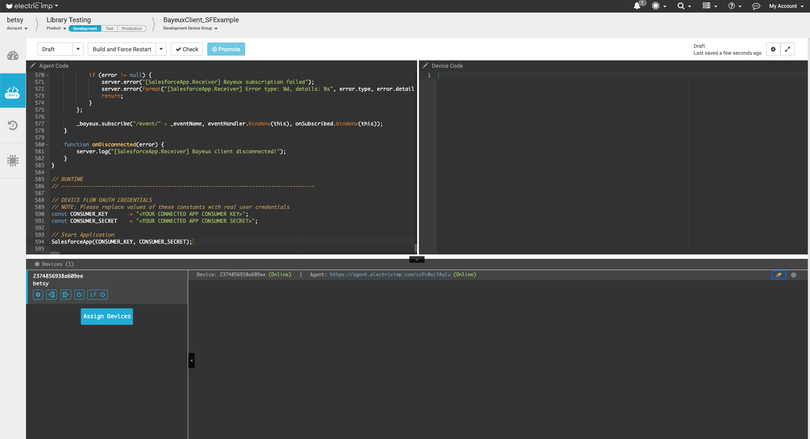
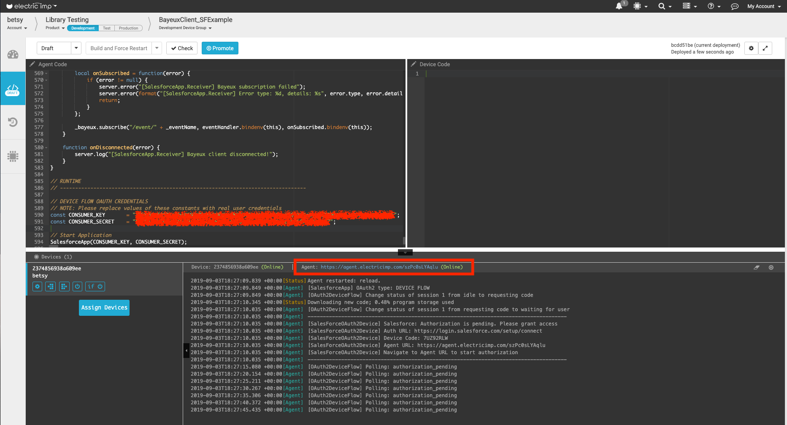

# Bayeux Client Examples #

This document describes the example applications provided with the [BayeuxClient library](../README.md).

## Salesforce Example ##

This example

- Authenticates the device on Salesforce platform using the [OAuth2 library](https://github.com/electricimp/OAuth-2.0) Device Flow and a Salesforce Connected Application's Consumer Key and Consumer Secret.
- Subscribes to the events channel created on Salesforce during the setup.
- Periodically (every ten seconds) sends an event to the cloud. The event contains the current timestamp.
- Logs all events received from the cloud (exactly the events sent in the previous point).

This example uses the [Salesforce library](https://github.com/electricimp/Salesforce) for sending the events and the [BayeuxClient library](../README.md) for receiving them.

### Source Code ###

[SalesforceOAuth2Example.agent.nut](./SalesforceOAuth2Example.agent.nut)

### Example Setup ###

#### Set Up An imp-enabled Device ####

1. Add a development device to [your account](https://developer.electricimp.com/gettingstarted)
1. In [Electric Imp's impCentral™](https://impcentral.electricimp.com) create new a Product and a Development Device Group.
1. Assign the device to the newly created Device Group.
1. Copy the [Salesforce example source code](./SalesforceOAuth2Example.agent.nut) and paste it into Device Group’s code editor as the agent code.
1. Leave impCentral open in your browser &mdash; you will be returning to it later.

#### Login To Salesforce ####

If you are not registered as a developer, [create a developer account](https://developer.salesforce.com/signup).

Now login to [Salesforce Developer Edition org](https://login.salesforce.com/). 

#### Create A Salesforce Connected Application ####

This stage is used to authenticate the imp application in Salesforce.

1. Click the **Setup** icon in the top-right navigation menu and select **Setup**:

1. Enter `App Manager` in the **Quick Find** box and then select **AppManager**:

1. Click **New Connected App**.
1. In the **New Connected App** form, enter:
    - In the **Basic Information** section:
        - Connected App Name: `Electric Imp Example`.
        - API Name: this will automatically become `Electric_Imp_Example`.
        - Contact Email: enter your email address.
    - In the **API (Enable OAuth Settings)** section:
        - Check **Enable OAuth Settings**.
        - Check **Enable Device Flow**.
        - Callback URL should auto fill with **https://login.salesforce.com/services/oauth2/success**.
        -  Under **Selected OAuth Scopes**:
            - Select **Access and manage your data (api)**.
            -  Click **Add**
            - Select **Perform requests on your behalf at any time (refresh_token, offline_access)**.
            -  Click **Add**

    - Click **Save**.
    - Click **Continue**.
1. You will be redirected to your Connected App’s page.
    - Make a note of your **Consumer Key** (you will need to enter it into your agent code).
    - Click **Click to reveal** next to the **Consumer Secret** field.
    - Make a note of your **Consumer Secret** (you will need to enter it into your agent code):

1. **Do not close the Salesforce page**.

#### Create A Platform Event In Salesforce ####

Platform Events transfer the data from the device to Salesforce.

The Platform Event fields must have the names and types mentioned here. If you change anything in the Platform Event definition, you will need to update the imp’s agent code. The names of the Platform Event and its field are entered into the agent code as constants *EVENT_NAME* and *EVENT_FIELD_NAME*.

1. On the Salesforce page, click the **Setup** icon in the top-right navigation menu and select **Setup**:

1. Enter `Platform Events` into the **Quick Find** box and then select **Integrations > Platform Events**:

1. Click **New Platform Event**.
1. In the **New Platform Event** form, enter:
    - Field Label: `Test Event`.
    - Plural Label: `Test Events`.
    - Object Name: `Test_Event`:

    - Click **Save**.
1. You will be redirected to the **Test Event** Platform Event page. Now you need to create a two Platform Event fields. In the **Custom Fields & Relationships** section, click **New** to create the field:

1. In the **New Custom Field** form, enter:
    - Data Type: **Text**.
    - Click **Next**.
    - Field Label: **My Timestamp**.
    - Length: **20**.
    - Field Name: **My_Timestamp**.
    - Click **Save**.
1. Repeat creating a new field steps to add the `Device Id` Field. In the **Custom Fields & Relationships** section, click **New** & in the **New Custom Field** form, enter:
    - Data Type: **Text**.
    - Click **Next**.
    - Field Label: **Device Id**.
    - Length: **16**.
    - Field Name: **Device_Id**.
    - Click **Save**. 
1. Confirm that the API Names for the Platform Event and Fields match the code. 
    - If you have altered the names used in these instructions, you will need to update the **EVENT_NAME** constant and the **EVENT_FIELDS** enum found under the **APPLICATION CLASSES** section. 
    - If you have kept the names used in these instructions the API names will be as follows:  
        - *Test Event API Name* is **Test_Event__e** 
        - **Custom Fields & Relationships** contains two fields:
            - *My Timestamp API Name* is **My_Timestamp__c** 
            - *Device Id API Name* is **Device_Id__c**

### Add API Keys To Your Agent Code ###

1. Return to impCentral.
1. Find the *SALESFORCE CONSTANTS* section at the **end** of the agent code, and enter the **Consumer Key** and **Consumer Secret** from the steps above as the values of the *CONSUMER_KEY* and *CONSUMER_SECRET* constants, respectively:

1. Again, **do not close impCentral**.

### Start The Electric Imp Application & Authenticate the Device ###

1. In the impCentral code editor, click **Build and Force Restart** to syntax-check, compile and deploy the code.
1. In the log pane, you should see a `Authorization is pending. Please grant access` message. This example uses OAuth 2.0 Device Flow for authentication, and the agent url has been configured to launch a web page to help with device authentication.
    - Click the agent URL in impCentral:

    - A new tab will open and you will see simple webpage where you can easily copy the *Device Authentication Code*. Once you have clicked to copy the code, click on the login redirect link.
    - You will be redirected to a Salesforce Page where you can paste the *Device Authentication Code* into a form. If for any reason the copy/paste did not work, you can go back to the IDE and look in the logs for the *Device Code*. Paste the code into the form and click **Connect**.
    - Follow the instructions on each webpage to grant access to your Salesforce account. If you are not logged in already you will be asked to log in.
    - Once authorization is completed, you will be redirected to your Salesforce account homepage. Close that page and return to impCentral.
1. Make sure there are no errors in the logs.
1. Make sure there are periodic logs like this:

1. Your application is now up and running.
1. You may check that the value of the **My_Timestamp__c** field in the received event is equal to the value in the sent event.
