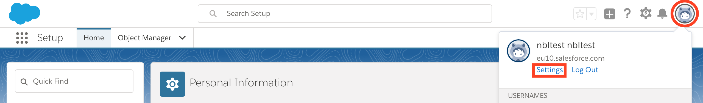
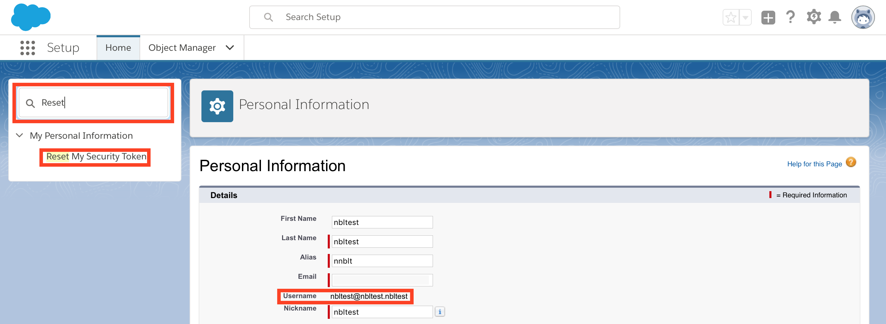

# Test Instructions

The tests in the current directory are intended to check the behavior of the BayeuxClient library.

They are written for and should be used with [impt](https://github.com/electricimp/imp-central-impt). See [impt Testing Guide](https://github.com/electricimp/imp-central-impt/blob/master/TestingGuide.md) for the details of how to configure and run the tests.

The [Salesforce.agent.test.nut](./Salesforce.agent.test.nut) test for BayeuxClient library uses Salesforce platform and requires pre-setup described below. The Salesforce platform is used for testing purposes due to absence of any public Bayeux servers appropriate for testing.

The other tests can be [run](#run-tests) without any pre-setup.

## Configure Salesforce

1. [Login To Salesforce](../examples/README.md#login-to-salesforce)
1. [Create a Salesforce Connected Application and obtain **Consumer Key** and **Consumer Secret**](../examples/README.md#create-a-salesforce-connected-application)
1. [Create Platform Event in Salesforce](../examples/README.md#create-platform-event-in-salesforce)
1. Obtain **Username** and **Security token**
    1. Launch your Developer Edition org.
    1. On the Salesforce page, click your profile icon in the top-right navigation menu and select **Settings**.

    1. Make a note of your **Username**.
    1. Enter **Reset** in the Quick Find box and then select **Reset My Security Token**.

    1. Click the **Reset Security Token** button.
    1. Then you will get an email from Salesforce with your new **Security token**. It will be needed in the next step.

## Set Environment Variables (only for the Salesforce test)

- Set *SALESFORCE_TEST_CONSUMER_KEY* environment variable to the value of **Consumer Key** obtained earlier.\
The value should look like `3MVG9mIli7ewofGtFMOuXXXXXXXX4ylsz6cdDZ4kjtqwZn256uEhQkM1ubTnktUdZViw2tfBgcNidXJOlHUv8`.
- Set *SALESFORCE_TEST_CONSUMER_SECRET* environment variable to the value of **Consumer Secret** obtained earlier.\
The value should look like `34956xxxxx2882569`.
- Set *SALESFORCE_TEST_USERNAME* environment variable to the value of your **Username** obtained earlier.\
The value should look like `aaa@bbb.ccc`.
- Set *SALESFORCE_TEST_PASSWORD* environment variable to the value of your **Salesforce Password** concatenated with **Security token** obtained earlier.\
The value should look like `yourpasswordXXXXXXSECURITYTOKENXXXXXX`.
- For integration with [Travis](https://travis-ci.org) set *EI_LOGIN_KEY* environment variable to the valid impCentral login key.

## Run Tests

- See [impt Testing Guide](https://github.com/electricimp/imp-central-impt/blob/master/TestingGuide.md) for the details of how to configure and run the tests.
- Run [impt](https://github.com/electricimp/imp-central-impt) commands from the root directory of the lib. It contains a default test configuration file which should be updated by *impt* commands for your testing environment (at least the Device Group must be updated).
